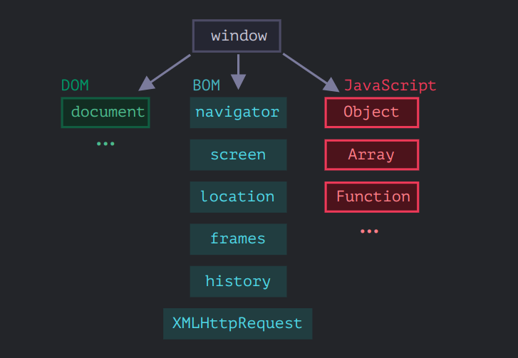

# Browser environment and specs



[➡️ refer-here](https://javascript.info/browser-environment)

# DOM(Document Object Model)

- **DOM** is data representation of the objects that compromise the structure and content document on the web.

- **Document object model** is the progamming interface (**API**) for the web documents.

- There’s a “root” object called window. It has two roles:
  1. It is a global object for JavaScript code.
  2. It represents **browser window** and methods to control it.

```  
    function sayHello () {

    console.log("Hello")

    }

    window.sayHello();// Hello

 ```
